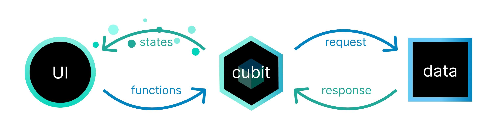
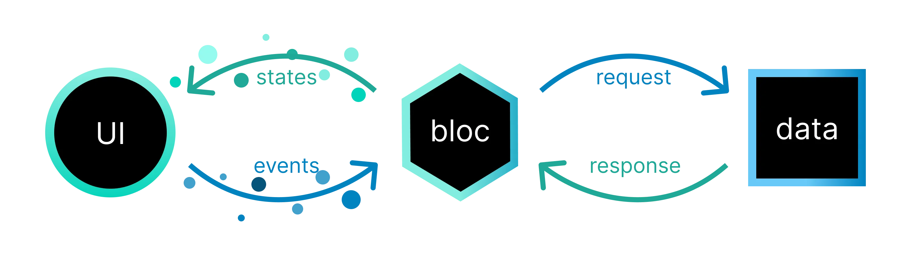

# Flutter Bloc 状态管理的使用

[中文文档](https://bloclibrary.dev/zh-cn)

- 安装：

```bash
flutter pub add flutter_bloc
```

## Cubit （关节）

Cubit 是扩展自 BlocBase 的类并可以扩展用于管理任何类型的状态。典型的流输出



通过公开调用函数来改变状态，状态是由 `Cubit` 进行输出，然后 UI 组件订阅状态变化，收到通知后进行重绘
。

简单例子：

1、创建一个 `Cubit` 类来管理一个状态

```dart
class CounterCubit extends Cubit<int>{
  //  CounterCubit() : super(0); 创建Cubit的时候需要定义管理状态的类型，这里只是简单的int，复杂的应该是一个class而不是值类型
  CounterCubit(int initState):super(initState);

  void increment() => emit(state + 1); // 通过emit来改变状态的值（emit是保护方法只能在Cubit类中使用）


  // 当产生新的状态时（状态更新之前）被触发,可以重写onChange方法来监听变化
  @ovrride
  void onChnage(Change<int> change){ // change 包含currentState和nextState
    super.onChange(change);
    print(change);
  }


}

// 使用方法
void main(){
  final cubit = CounterCubit(0);
  print(cubit.state); // 0
  cubit.increment();
  print(cubit.state); // 1
  cubit.close(); // 关闭内部状态流


   CounterCubit()
    ..increment()
    ..close(); // Change { currentState: 0, nextState: 1 }

}
```

2、 `Cubit` 公开了一个流 Stream 供使用者订阅状态更新

```dart
Future<void> main() async {
  final cubit = CounterCubit(0);
  final subscription = cubit.stream.listen(print); // 每次状态变化都会触发输出,只有在 Cubit 上调用 listen 时才会收到后续状态变化
  cubit.increment();
  await Future.delayed(Duration.zero); // 为了避免 subscription 被立即取消
  await subscription.cancel(); // 取消订阅
  await cubit.close(); // 关闭Cubit
}
```

3、 bloc 可以在一个位置访问到所有的`Changes`，便于大型项目中的多个状态`Cubits`管理

通过创建 `BlocObserver` 来实现

```dart
class SimpleBlocObserver extends BlocObserver  {
  @override
  void onChange(BlocBase bloc, Change change){
    super.onChange(bloc,change);
    print('${bloc.runtimeType} $change');
  }
}


// 使用只需要在 main 函数中注册

void main(){
  Bloc.observer = SimpleBlocObserver();
  CounterCubit()
    ..increment()
    ..close(); //
}


// 会触发输出
// CounterCubit Change { currentState: 0, nextState: 1 } // 内部重写的onChange
// Change { currentState: 0, nextState: 1 } // BlocObserver 的 onChange

```

优先级：内部重写的 onChange 先会被调用，它再调用 super.onChange 通知 BlocObserver 的 onChange

在 BlocObserver 中，除了 Change 本身之外，我们还可以访问 Cubit 实例。

4、 错误处理

每个 `Cubit` 都有一个`addError` 方法用于发送错误，通过重写`onError` 事件可以监听到错误

可以在 Cubit 中覆盖 onError 来处理特定 Cubit 的所有错误。

```dart
class CounterCubit extneds Cubit<init>{
  CounterCubit(int initState):super(initState);

  void increment()=>{
    addError(Exception('increment add error!'),StackTrace.current);
    emit(state+1);
  }


  @override
  void onChange(Change<int> change) {
    super.onChange(change);
    print(change);
  }


  @override
  void onError(Object error,StackTrace stackTrace){
    print('${error},${stackTrace}');
    super.onError(error,stackTrace);
  }

}
```

通过在 `BlocObserver` 中重写 `onError` 来实现全局监听错误报告

优先级：与 onChange 一样，内部重写的 onError 会在全局 BlocObserver 重写的 onError 之前被调用。

```dart
class SimpleBlocObserver extends BlocObserver {
  @override
  void onChange(BlocBase bloc, Change change) {
    super.onChange(bloc, change);
    print('${bloc.runtimeType} $change');
  }

  @override
  void onError(BlocBase bloc, Object error, StackTrace stackTrace) {
    print('${bloc.runtimeType} $error $stackTrace');
    super.onError(bloc, error, stackTrace);
  }
}
```

运行输出：

```bash
Exception: increment error!
#0      CounterCubit.increment (file:///main.dart:7:56)
#1      main (file:///main.dart:41:7)
#2      _delayEntrypointInvocation.<anonymous closure> (dart:isolate-patch/isolate_patch.dart:297:19)
#3      _RawReceivePort._handleMessage (dart:isolate-patch/isolate_patch.dart:184:12)

CounterCubit Exception: increment error!
#0      CounterCubit.increment (file:///main.dart:7:56)
#1      main (file:///main.dart:41:7)
#2      _delayEntrypointInvocation.<anonymous closure> (dart:isolate-patch/isolate_patch.dart:297:19)
#3      _RawReceivePort._handleMessage (dart:isolate-patch/isolate_patch.dart:184:12)

CounterCubit Change { currentState: 0, nextState: 1 }
Change { currentState: 0, nextState: 1 }
```

## Bloc

如果是处理函数，使用 `Bloc` 来进行管理依赖，`Bloc` 是一个依赖 `事件` 触发 `状态`变更的更高级的类。同
样是扩展了 `BlocBase` 来实现，因此和 `Cubit` 拥有公共的 API，`Bloc` 不是调用`Bloc`上的函数来发出新的
状态，而是接收 `事件` 并将传入的事件转换为传出的状态。



1、 创建一个 `Bloc`

- EventHandler 可以访问添加的事件以及 `Emitter`，`Emitter` 可以对输入的事件发出零个或者多个状态。

- 然后我们可以更新 EventHandler 来处理 CounterIncrementPressed 事件：

```dart
sealed class CounterEvent {}

final class CounterIncrementPressed extends CounterEvent {}


class CounterBloc extends Bloc<CounterEvent,int> {
    // 状态变更 必须通过 on<Event> API注册事件处理程序。。事件处理程序负责将任何传入事件转换为零个或多个传出状态。
  CounterBloc():suepr(0){

      on<CounterIncrementPressed>((event,emit){
          // 处理事件并发出状态
          emit(state+1);
      })
  }


  // 观察

  @override
  void onChange(Change<int> change){
    super.onChange(change);
    print(change);
  }


}


```

- Blocs 任何时候都不应该 emit 新的状态。相反，每次状态变更都必须在 EventHandler 里响应并输出。

- blocs 和 cubits 都会忽略重复的状态。如果 state == nextState 时我们发出 State nextState ，不会有状
  态变更发生。

2、 使用

```dart
Future<void> main() async {
  final bloc = CounterBloc();
  print(bloc.state); // 0
  final subscription = bloc.stream.listen(print); // 1 订阅
  bloc.add(CounterIncrementPressed());
  await Future.delayed(Duration.zero); // 用来确保我们等待下一个事件循环周期,确保EventHandler 处理了这个事件
  print(bloc.state); // 1
  await subscription.cancel(); // 订阅取消
  await bloc.close();
}
```

3、 `onTransition` 可以捕获有关触发状态变化的信息

因为 bloc 是通过事件驱动，因此可以捕获有关触发状态变化的信息,从一个状态变成另一个状态称为 过渡。一个
过渡 包含了当前状态，触发事件以及下一个状态。

```dart

sealed class CounterEvent {}

final class CounterIncrementPressed extends CounterEvent {}

class CounterBloc extends Bloc<CounterEvent, int> {
  CounterBloc() : super(0) {
    on<CounterIncrementPressed>((event, emit) => emit(state + 1));
  }

  @override
  void onChange(Change<int> change) {
    super.onChange(change);
    print(change);
  }

  @override
  void onTransition(Transition<CounterEvent, int> transition) {
    super.onTransition(transition);
    print(transition);
  }
}

```

输出:

```bash
Transition { currentState: 0, event: Instance of 'CounterIncrementPressed', nextState: 1 }
Change { currentState: 0, nextState: 1 }
```

onTransition 在 onChange 之前被调用并且包含了触发 currentState 到 nextState 的事件。

同理可以在 `BlocObserver` 中重写 `onTransition` 来实现全局监听(优先级：先本地再全局)

4、 重写 `onEvent` 来监听事件添加

如果重写 onEvent 方法，无论什么时候有新的事件被添加到 Bloc，这个方法都会被调用。和 onChange 和
onTransition 方法一样，onEvent 也可以在本地或者全局被重写。

当事件被添加时，onEvent 会被立即调用。本地的 onEvent 会在 BlocObserver 的全局 onEvent 之前被调用。

```dart
class SimpleBlocObserver extends BlocObserver {
  @override
  void onEvent(Bloc bloc,Object? event){
    super.onEvent(bloc, event);
    print('${bloc.runtimeType} $event');
  }
}

```

5、错误处理同 Cubit 一样 拥有 `addError` 和 `onError` 方法

## 什么时候使用 Cubit 和 Bloc

- Cubit 用于管理简单的状态，通常是值类型，如 int、String 或 bool。
- Bloc 用于管理更复杂的状态，通常是对象或数据结构。
- 如果需要处理错误或监听事件，使用 Bloc。
- 如果只需要管理简单的状态，使用 Cubit。
- Bloc 可以溯源，捕获相关触发时机
- Bloc 还有一些操作符，例如 `buffer` 、`debounceTime` 、`throttle` 等
- 如果你不确定应该用哪一种，先用 Cubit，后面根据需要你可以再重构或者升级为 Bloc。

## 提供的组件

- `BlocBuilder` ：用于构建 UI 组件，当状态变化时会自动重绘

- `BlocProvider`：透过 BlocProvider.of<T>(context) 将一个 bloc 提供给它的 children。BlocProvider 用
  作于依赖注入（DI）widget ，以便在子树 (subtree) 中可以提供单个 bloc 实例给多个 widget 使用

- `MultiBlocProvider`: 用来将多个 BlocProvider Widgets 合并为一个

例如不用 `MultiBlocProvider` 时，需要这么写:

```dart
BlocProvider<BlocA>(
  create: (BuildContext context) => BlocA(),
  child: BlocProvider<BlocB>(
    create: (BuildContext context) => BlocB(),
    child: BlocProvider<BlocC>(
      create: (BuildContext context) => BlocC(),
      child: ChildA(),
    ),
  ),
);
```

使用了之后：

```dart
MultiBlocProvider(
  providers: [
    BlocProvider<BlocA>(
      create: (BuildContext context) => BlocA(),
    ),
    BlocProvider<BlocB>(
      create: (BuildContext context) => BlocB(),
    ),
    BlocProvider<BlocC>(
      create: (BuildContext context) => BlocC(),
    ),
  ],
  child: ChildA(),
);
```
