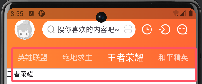
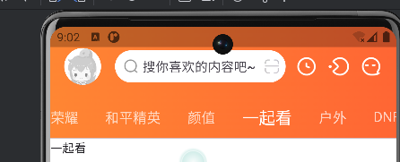
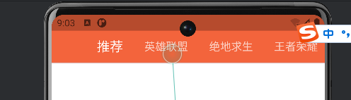
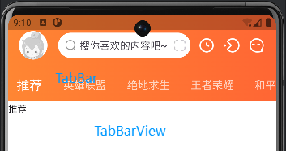

# 某些组件或者属性的作用

[FLutter 组件文档](https://api.flutter.dev/flutter/widgets/widgets-library.html)

## GestureDetector

- 手势检测器 用于检测用户在屏幕上的触摸、点击、长按等手势
- 常用属性
  - onTap: 点击事件
  - onTapCancel: 点击取消事件
  - onTapDown: 按下事件
  - onTapUp: 抬起事件
- 使用场景
  - 按钮点击
  - 图片点击
  - 文字点击

## ShapeDecoration

- 形状装饰器 用于设置形状的装饰效果
- 常用属性
  - color: 颜色
  - shape: 形状
- 使用场景
  - 圆角
  - 边框

## CustomPaint

- 自定义绘制 用于自定义绘制
- 常用属性
  - painter: 绘制器
- 使用场景
  - 绘制圆弧
  - 绘制圆形
  - 绘制文字

像开屏页的倒计时就是用 CustomPaint 绘制的：


## BoxDecoration

- 盒子装饰器 用于设置盒子的装饰效果
- 常用属性
  - color: 颜色
  - shape: 形状
- 使用场景
  - 背景
  - 边框

像下面这种渐变就是用 BoxDecoration 实现的：


## Stack

- 堆栈 用于将多个组件堆叠在一起
- 常用属性
  - alignment: 对齐方式
  - children: 子组件

## Positioned

- 用于设置子组件在 Stack 中的位置
- 常用属性
  - bottom: 距离底部
  - top: 距离顶部
  - left: 距离左边
  - right: 距离右边
  - child: 子组件

## ClipRRect

- 裁剪圆角矩形 用于裁剪组件的圆角矩形
- 常用属性
  - borderRadius: 圆角
  - child: 子组件

例如头部 header 组件中的头像就是用 ClipRRect 裁剪的：


```dart
ClipRRect(
  borderRadius: BorderRadius.all(
    Radius.circular(dp(20)),
  ),
  child: GestureDetector(
    onTap: () {
      //TODO: 显示login
    },
    child: Image.asset(
      'images/default-avatar.webp',
      width: dp(40),
      height: dp(40),
      fit: BoxFit.fill,
    ),
  ),
),
```

## Expanded

- 用于将子组件扩展到剩余空间,例如 css 中的 flex:1
- 常用属性
  - child: 子组件
  - flex: 扩展比例

## Padding

- 用于设置组件的内边距
- 常用属性
  - padding: 内边距
  - child: 子组件

## Row

- 用于将子组件水平排列,如果想要一行布局用 Row 就行了，例如 css 中的
  `display:flex;flex-direction:row;`
- 常用属性
  - children: 子组件
  - mainAxisAlignment: 主轴对齐方式
  - crossAxisAlignment: 交叉轴对齐方式

## Columns

- 用于将子组件垂直排列,如果想要一列布局用 Column 就行了，例如 css 中的
  `display:flex;flex-direction:column;`
- 常用属性
  - children: 子组件
  - mainAxisAlignment: 主轴对齐方式
  - crossAxisAlignment: 交叉轴对齐方式

## TextField

- 用于输入文本
- 常用属性
  - controller: 控制器
  - decoration: 装饰器

例如头部 header 组件中的搜索框就是用的`TextField`

```dart

final TextEditingController _search = TextEditingController();


TextField(
  controller: _search,
  cursorColor: DyBase.defaultColor,
  cursorWidth: 1.5,
  style: TextStyle(
    color: DyBase.defaultColor,
    fontSize: sp(14.0),
  ),
  decoration: const InputDecoration(
    border: OutlineInputBorder(
      borderSide: BorderSide.none,
    ),
    contentPadding: EdgeInsets.all(0),
    hintText: '搜你喜欢的内容吧~',
  ),
),
```

## PageView

- 用于实现页面滑动和底部 tab 导航栏切换效果
- 常用属性
  - controller: 控制器
  - itemBuilder: 子组件构建器

例如首页的页面滑动和底部 tab 导航栏切换效果就是用 PageView 实现的：

```dart
final PageController _pageController = PageController();

PageView.builder(
  itemBuilder: (context, index) => pages[index],
  physics: const NeverScrollableScrollPhysics(), // 禁止滑动
  controller: _pageController, // 页面控制器
  itemCount: pages.length, // 页面数量
);
```

## ElevatedButton 和其他按钮

- 用于显示一个带阴影的按钮
- 常用属性
  - onPressed: 点击事件
  - child: 子组件
  - style: 样式

可以参考文档进行学习：

https://material.io/design/components/buttons.html

https://m3.material.io/components/buttons

## DefaultTabController

- 用于实现底部 tab 导航栏切换效果
- 常用属性

  - length: 页面数量
  - child: 子组件（TabBar）
  - body: 子组件（TabBarView）

- 示例网站：
  - https://api.flutter.dev/flutter/material/DefaultTabController-class.html



## NestedScrollView

- 用于实现嵌套滑动效果
- 常用属性

  - headerSliverBuilder: 头部构建器
  - body: 子组件
  - controller: 控制器

- 示例网站：
  - https://api.flutter.dev/flutter/widgets/NestedScrollView-class.html

## SliverAppBar

- 用于实现下拉收起头部效果
- 常用属性

  - backgroundColor: 背景颜色
  - systemOverlayStyle: 系统覆盖样式
  - pinned: 固定
  - floating: 浮动
  - expandedHeight: 扩展高度
  - flexibleSpace: 灵活空间 FlexibleSpaceBar
  - forceElevated: 强制显示阴影
  - bottom: 底部组件
  - snap: 是否自动滚动

- 示例网站:
  - https://api.flutter.dev/flutter/material/SliverAppBar-class.html

默认状态:



下拉收起效果:



## TabBar

- 用于实现顶部 tab 导航栏切换效果
- 常用属性
  - indicator: 指示器
  - isScrollable: 是否可滚动
  - unselectedLabelStyle: 未选中样式 label
  - labelStyle: 选中样式
  - tabs: 标签
  - labelColor: 选中颜色
  - unselectedLabelColor: 未选中颜色
  - indicatorWeight: 指示器权重
  - indicatorColor: 指示器颜色
  - indicatorSize: 指示器大小 // 指示器大小计算方式，TabBarIndicatorSize.label 跟文字等宽
    ,TabBarIndicatorSize.tab 跟每个 tab 等宽
  - indicatorPadding: 指示器内边距

## TabBarView

- 用于实现顶部 tab 导航栏切换效果的页面
- 常用属性

  - children: 子组件

- 示例网站:
  - https://api.flutter.dev/flutter/material/TabBarView-class.html


